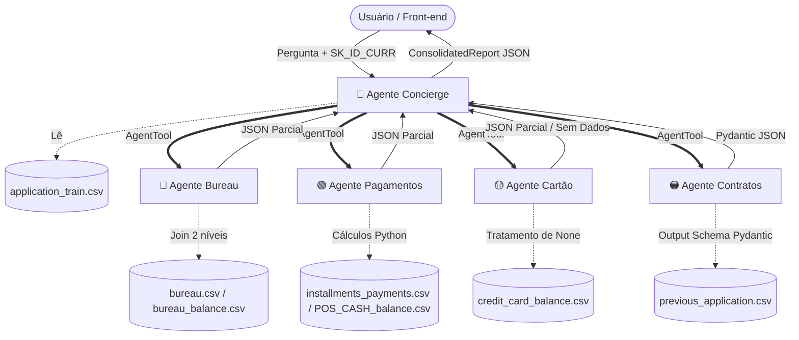

# 🏦 Home Credit Credit Analysis — Sistema Multi-Agente (Google ADK)

[](https://www.python.org/)
[](https://github.com/google/agent-development-kit)
[](https://www.kaggle.com/c/home-credit-default-risk)
[]()

Este é um projeto de estágio estruturado para o desenvolvimento de um **sistema multi-agente de análise de crédito** autônomo. O sistema consome dados reais da Home Credit (organizados em 7 tabelas relacionais) e é construído inteiramente com o **Google Agent Development Kit (ADK)** como SDK de desenvolvimento e orquestração de IA Generativa.

O diferencial deste projeto é que ele **não é um modelo de Machine Learning** clássico nem um dashboard de BI. Trata-se de uma rede colaborativa de agentes autônomos que invocam ferramentas em Python para processar, agregar e estruturar análises analíticas de forma determinística, entregando relatórios consolidados em formato estruturado.

---

## 🗺️ Sumário

- [🏦 Home Credit Credit Analysis — Sistema Multi-Agente (Google ADK)](#-home-credit-credit-analysis--sistema-multi-agente-google-adk)
  - [🗺️ Sumário](#️-sumário)
  - [🏗️ Arquitetura do Sistema](#️-arquitetura-do-sistema)
    - [Hierarquia e Fluxo de Agentes](#hierarquia-e-fluxo-de-agentes)
  - [👥 Os 5 Agentes do Sistema](#-os-5-agentes-do-sistema)
    - [1. 👑 Agente Concierge (Orquestrador)](#1--agente-concierge-orquestrador)
    - [2. 🔵 Agente de Bureau Externo](#2--agente-de-bureau-externo)
    - [3. 🟢 Agente de Pagamentos](#3--agente-de-pagamentos)
    - [4. 🟡 Agente de Cartão de Crédito](#4--agente-de-cartão-de-crédito)
    - [5. 🟠 Agente de Contratos Internos](#5--agente-de-contratos-internos)
  - [📊 Estrutura do Dataset](#-estrutura-do-dataset)
    - [Mapeamento de Joins e Modelagem (BigQuery)](#mapeamento-de-joins-e-modelagem-bigquery)
  - [📅 Cronograma de 4 Semanas](#-cronograma-de-4-semanas)
    - [Semana 1: Fundação](#semana-1-fundação)
    - [Semana 2: Especialistas](#semana-2-especialistas)
    - [Semana 3: Orquestração](#semana-3-orquestração)
    - [Semana 4: Qualidade \& Demo](#semana-4-qualidade--demo)
  - [👥 Integrantes da Equipe](#-divisão-da-equipe-4-integrantes)
  - [🛠️ Configuração e Instalação](#️-configuração-e-instalação)
  - [📜 Contrato de Saída (JSON Consolidado)](#-contrato-de-saída-json-consolidado)

---

## 🏗️ Arquitetura do Sistema

O sistema é construído sobre o padrão **Orchestrator-Workers**, em que o agente principal (Concierge) atua como orquestrador central recebendo a pergunta do usuário e um ID de cliente (`SK_ID_CURR`). Ele lê o perfil básico e delega consultas específicas para 4 sub-agentes especialistas, cada um responsável por um ecossistema de dados isolado.

### Hierarquia e Fluxo de Agentes



---

## 👥 Os 5 Agentes do Sistema

### 1. 👑 Agente Concierge (Orquestrador)
* **Tabela Principal:** `application_train.csv`
* **Descrição:** É a interface principal do sistema. Lê informações demográficas e dados básicos de renda do cliente, cria o contexto da sessão (`Session`) e delega as consultas complexas aos sub-agentes por meio do primitivo `AgentTool`.
* **Própria Tool:** `get_client_profile(sk_id)`
* **Regra Importante:** Não possui lógica de roteamento em código Python (ex. `if` ou `classify_question`). O roteamento ocorre de forma puramente semântica através das **system instructions** e das **docstrings das tools** do Google ADK.

### 2. 🔵 Agente de Bureau Externo
* **Tabelas Relacionadas:** `bureau.csv` e `bureau_balance.csv`
* **Descrição:** Especialista em mapear o comportamento de crédito do cliente fora da Home Credit.
* **Cálculos e Joins:** Executa o join complexo de dois níveis (`bureau_balance` → `bureau` via `SK_ID_BUREAU`, e `bureau` → `application` via `SK_ID_CURR`).
* **Tools:**
  * `get_active_credits(sk_id)` — créditos ativos externos com tipo e valor.
  * `get_debt_summary(sk_id)` — total da dívida ativa externa e máximo histórico de dias em atraso.
  * `get_status_trend(sk_id)` — tendência do status do bureau mensal (estável, melhorando ou piorando).

### 3. 🟢 Agente de Pagamentos
* **Tabelas Relacionadas:** `installments_payments.csv` e `POS_CASH_balance.csv`
* **Descrição:** Analisa a pontualidade e os padrões de adimplemento das parcelas internas acordadas com a Home Credit.
* **Tools:**
  * `get_avg_delay_days(sk_id)` — média de dias de atraso histórico de parcelas pagas.
  * `get_underpayment_rate(sk_id)` — percentual de parcelas pagas com valor inferior ao previsto.
  * `get_pos_dpd_history(sk_id)` — percentual de meses com DPD > 0 em contratos POS.
  * `get_active_pos_contracts(sk_id)` — lista de contratos do tipo POS que continuam ativos.
* **Regra Importante:** Todos os cálculos e operações aritméticas são processados puramente em Python. Nenhum DataFrame bruto ou linhas agregadas de tabelas são entregues diretamente para o LLM.

### 4. 🟡 Agente de Cartão de Crédito
* **Tabela Relacionada:** `credit_card_balance.csv`
* **Descrição:** Analisa a fatura e o comportamento financeiro rotativo do cliente em linhas de cartão de crédito Home Credit.
* **Tools:**
  * `get_limit_utilization(sk_id)` — taxa média de utilização do limite de crédito atribuído.
  * `get_min_payment_rate(sk_id)` — percentual de meses em que apenas o pagamento mínimo foi pago.
  * `get_balance_trend(sk_id)` — tendência cronológica de evolução do saldo dos últimos 6 meses.
* **Tratamento de Borda:** Muitos clientes não utilizam cartões. As tools deste agente tratam exceções e ausência de dados de forma graciosa, retornando `{"sem_dados": true}` para testar a adaptabilidade do Concierge.

### 5. 🟠 Agente de Contratos Internos
* **Tabela Relacionada:** `previous_application.csv`
* **Descrição:** Avalia o histórico de tomadas de decisão e propostas feitas anteriormente na própria Home Credit.
* **Tools:**
  * `get_application_history(sk_id)` — lista de propostas anteriores divididas por status (Approved/Refused/Canceled).
  * `get_rejection_reasons(sk_id)` — análise e contagem de motivos de recusa em contratos rejeitados.
  * `get_top_products(sk_id)` — categorias mais frequentes de produtos contratados anteriormente.
* **Regra Importante:** Utiliza obrigatoriamente um `output_schema` baseado em classes Pydantic. A saída é estruturada de forma estrita de modo que o Concierge possa processá-la semanticamente sem riscos de formatações em texto livre.

---

## 📅 Cronograma de 4 Semanas

### Semana 1: Fundação
* **Objetivo:** Instalação do ADK, exploração inicial de dados e desenvolvimento de protótipos de ferramentas funcionais.
* **Dataset & Dados:**
  * Carga das 7 tabelas utilizando `pandas`.
  * Criação do mapeamento de joins a partir do `SK_ID_CURR`.
  * Criação da análise inicial de cobertura de dados (classificação de clientes com dados completos vs. parciais).
  * Desenvolvimento de joins manuais para 3 `SK_IDs` em formato puramente Python/Pandas.
* **Configuração & ADK:**
  * Instalação e teste básico do pacote `google-adk`.
  * Criação de um `LlmAgent` minimalista rodando com o `Runner` básico.
  * Escrita e teste isolado de duas funções Python decoradas com `@tool`.

### Semana 2: Especialistas
* **Objetivo:** Codificação e validação isolada dos 4 sub-agentes especialistas.
* **Implementação de Tools:**
  * Criação e validação das tools específicas de Bureau, Pagamento, Cartão e Contratos.
  * Aplicação rigorosa das regras pedagógicas (cálculos aritméticos em Python, output schema no agente de Contratos, tratamento de None no Cartão).
* **Testes Unitários:**
  * Execução individualizada de testes em cada especialista com 5 `SK_IDs` distintos.

### Semana 3: Orquestração
* **Objetivo:** Integração completa dos agentes, controle de turnos com Runner e histórico com Session.
* **Integração:**
  * Acoplamento dos sub-agentes no Concierge como `AgentTool`.
  * Engenharia de Prompt e `system_instruction` do Concierge para delegação inteligente.
  * Validação de fluxos conversacionais complexos e acionamento múltiplo de especialistas.
* **Runner + Session:**
  * Teste do comportamento persistente e influência do histórico da `Session` no comportamento do orquestrador.

### Semana 4: Qualidade & Demo
* **Objetivo:** Mapeamento de casos de borda, finalização da documentação técnica e apresentação prática.
* **Qualidade e Estresse:**
  * Bateria de testes de ponta a ponta com uma amostra superior a 15 clientes contrastantes.
  * Resolução de comportamentos inesperados ao usar perguntas ambíguas.
* **Entrega:**
  * Fechamento da documentação e demonstração prática demonstrando o potencial e a performance de 3 perfis contrastantes de clientes.

---

## 👥 Integrantes da Equipe

O time foi estruturado de forma que cada programador seja o **dono de um agente especialista** e participe ativamente das etapas transversais de engenharia de dados, infraestrutura e testes de qualidade.

**Arthur Faria**

**Gustavo Gomes**

**Gustavo Tucci**

**Jeniffer Oliveira**

---

## 🛠️ Configuração e Instalação

1. **Clone do Repositório:**
   ```bash
   git clone <url-do-repositorio>
   cd "Projeto Agentes"
   ```

2. **Criação do Ambiente Virtual (Virtualenv):**
   ```bash
   python -m venv .venv
   # No Windows (PowerShell):
   .venv\Scripts\Activate.ps1
   # No Linux/Mac:
   source .venv/bin/activate
   ```

3. **Instalação das Dependências:**
   Instale os pacotes principais requeridos, incluindo o SDK do Google ADK e bibliotecas acessórias:
   ```bash
   pip install google-adk pandas google-cloud-bigquery pydantic python-dotenv
   ```

4. **Configuração de Variáveis de Ambiente:**
   Crie um arquivo `.env` dentro da pasta `multi_agent_synapse` baseando-se nas credenciais da nuvem:
   ```env
   GOOGLE_API_KEY=sua_chave_aqui
   # Se necessário, configure as credenciais GCP para BigQuery:
   GOOGLE_APPLICATION_CREDENTIALS=caminho/para/credenciais.json
   ```

5. **Execução:**
   Para rodar o orquestrador:
   ```bash
   adk run multi_agent_synapse
   ```

---

## 📜 Contrato de Saída (JSON Consolidado)

O schema estruturado do `ConsolidatedReport` define o contrato rígido a ser devolvido pelo Concierge após a consulta de risco de crédito:

```json
{
  "sk_id_curr": 100002,
  "perfil": {
    "renda_anual": 202500.0,
    "tipo_renda": "Working",
    "anos_emprego": 7.3
  },
  "bureau": {
    "creditos_ativos": 3,
    "divida_total": 45000.0,
    "max_dias_atraso": 0,
    "tendencia_status": "Estável"
  },
  "pagamento": {
    "media_dias_atraso": 1.3,
    "pct_subpago": 0.12,
    "pct_meses_dpd": 0.05
  },
  "cartao": {
    "utilizacao_media": 0.43,
    "pct_pagamento_minimo": 0.20,
    "tendencia_saldo": "Reduzindo"
  },
  "contratos": {
    "taxa_aprovacao": 0.75,
    "motivos_rejeicao": ["HC", "LIMIT"],
    "produtos_top3": ["Consumer loans", "Cash loans"]
  },
  "agentes_acionados": ["bureau", "pagamento", "cartao", "contratos"],
  "narrativa": "Cliente apresenta histórico de crédito externo saudável e estável, porém demonstra leve tendência de atrasos nos pagamentos internos parcelados..."
}
```
